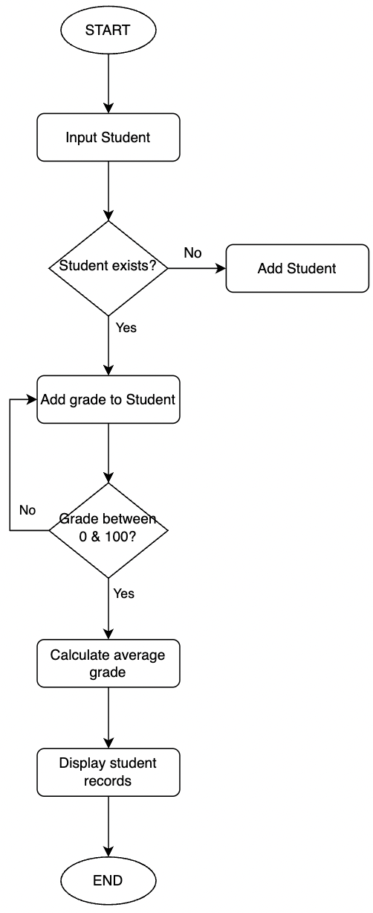

# Student grade management system

Peer-graded Assignment: Project Submission

## Project Requirements

### Functional

- Add new students with names and unique IDs.
- Assign grades to students for different subjects.
- Calculate the average grade for each student.
- Display student records with their grades and averages.

### Non-Functional

- The application should run as a console-based program.
- The system should handle input validation (e.g., prevent duplicate student IDs, and allow only valid grades).
- The program should store student data in memory (using lists or dictionaries).
- The system should be efficient in terms of execution time and memory usage.
- The program should have a simple and user-friendly interface.

## Objective

- Create a functional student grade management system that allows adding, modifying, and retrieving student records.
- Ensure the application is easy to navigate with a clear menu-driven interface.
- Implement proper data structures to store and manipulate student and grade information.
- Develop a robust system that handles invalid inputs gracefully.

## Design Outline

**Tasks Breakdown**

1. Create a Student class

- Attributes: id, name, grades (dictionary with subjects as keys and grades as values)
- Methods: add_grade(), calculate_average(), display_info()

2. Create a StudentManager class

- Attributes: A list or dictionary to store students
- Methods:
  - add_student() → Adds a new student
  - find_student() → Retrieves a student by ID
  - assign_grade() → Adds a grade for a specific subject
  - calculate_average() → Computes and displays the average grade
  - display_students() → Displays all student records

3. Implement a Menu System

- Use a loop to allow users to choose different operations (e.g., add student, enter grades, display records, exit).

**Flowchart**

